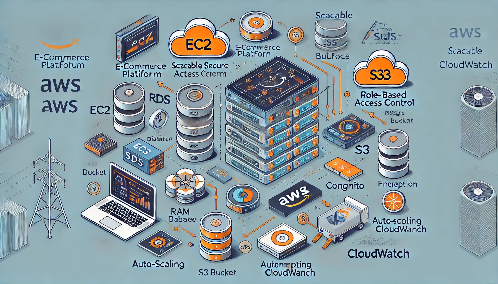
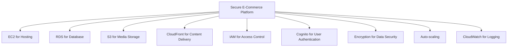
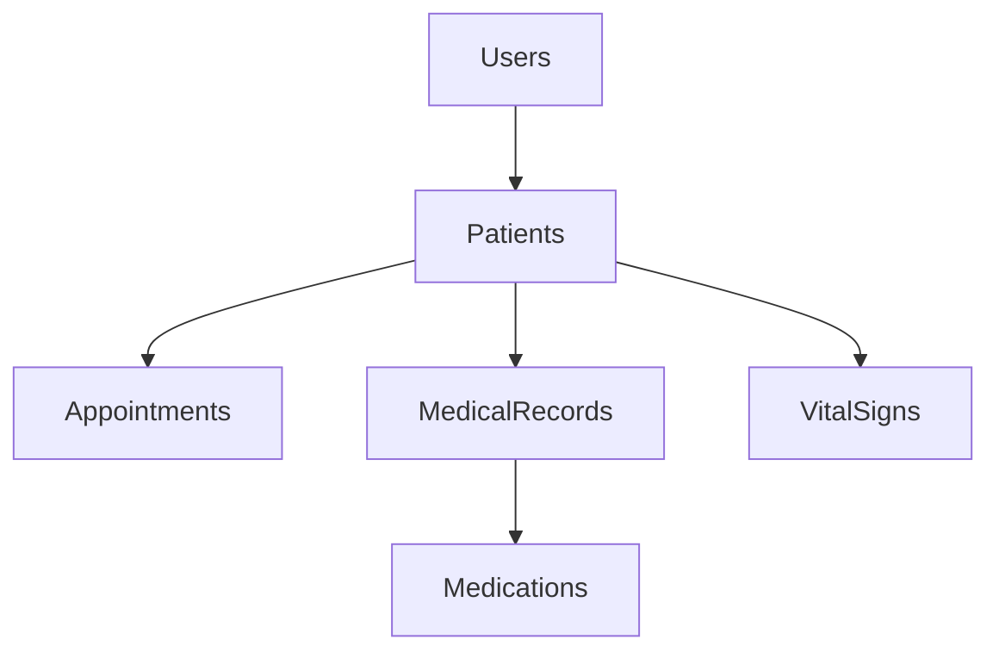
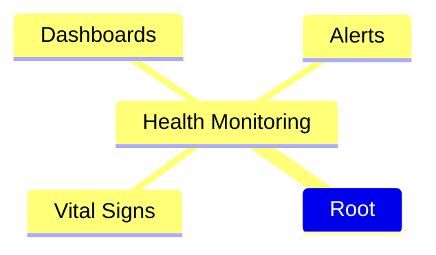

# 🌐 Project Ideas

## 1. 🛒 Secure E-Commerce Platform on AWS
**Description**: Build a scalable e-commerce platform using AWS services such as EC2, RDS, S3, and CloudFront. Implement secure payment processing, role-based access control (RBAC) with AWS IAM, and data encryption (both at rest and in transit).  
**Key Features**:
- Auto-scaling
- Secure architecture with encryption
- User authentication (Cognito)
- Logging/monitoring (CloudWatch)

---

## 2. 🗂️ Serverless File Upload and Processing Service
**Description**: Create a serverless file upload system using AWS Lambda, API Gateway, and S3. Users can upload files, trigger processing tasks using Lambda, and store results securely.  
**Key Features**:
- AWS Lambda for processing
- S3 for storage
- CloudWatch for monitoring
- IAM roles for access control
- S3 encryption for data security

---

## 3. 🌍 Multi-Tier Web Application with Load Balancing and Auto-Scaling
**Description**: Design a multi-tier architecture with an elastic load balancer, auto-scaling group, and RDS for the database. Implement VPC, IAM, and security groups.  
**Key Features**:
- High availability (ELB)
- Scalability (Auto Scaling)
- Secure network architecture (VPC)
- Monitoring (CloudWatch)

---

## 4. 🔍 AWS Cloud Security Audit and Compliance Automation
**Description**: Automate AWS security audits with services like AWS Config, CloudTrail, and GuardDuty. Ensure compliance by continuously monitoring and sending alerts for non-compliant activities.  
**Key Features**:
- AWS Config rules
- GuardDuty for threat detection
- CloudWatch alarms
- Automation with Lambda

---

## 5. 📊 Real-Time Data Analytics Pipeline
**Description**: Build a real-time data processing pipeline using AWS Kinesis for streaming, Lambda for processing, and DynamoDB/Redshift for storage. Secure with AWS KMS and monitor with CloudWatch.  
**Key Features**:
- Real-time data ingestion (Kinesis)
- Processing (Lambda)
- Scalable storage (DynamoDB/Redshift)
- Security (KMS, IAM)

---

## 6. 🛡️ Disaster Recovery and Backup Solution on AWS
**Description**: Set up a disaster recovery architecture using S3 for backups, RDS for snapshots, and Route 53 for DNS failover. Implement automated backup policies.  
**Key Features**:
- Automated backups
- Disaster recovery with RDS snapshots
- Cross-region replication
- Security with IAM roles and encryption

---

## 7. 🤖 Machine Learning Model Deployment with SageMaker
**Description**: Develop and deploy a machine learning model using AWS SageMaker. Store data in S3, preprocess with Lambda, and monitor with CloudWatch.  
**Key Features**:
- Model training (SageMaker)
- Deployment
- Secure data storage (S3)
- Monitoring (CloudWatch)
- Secure access (IAM)

---

---

# implementing personal experiance with aws

# 🏥 Secure Patient Management and Monitoring System

## 🎯 Project Overview
Develop a secure and efficient patient management and monitoring system for healthcare facilities, focusing on:
- Patient data management
- Appointment scheduling
- Real-time health monitoring
- Secure communication between patients and healthcare providers

## 🔐 Security Features
- **User Registration & Authentication**
  - Secure registration for patients, nurses, and admins
  - Multi-factor authentication (MFA)
  - Role-based access control (RBAC)

## 🗃️ Database Design
### Database Structure
**Tables:**
- Users
- Patients
- Appointments
- MedicalRecords
- Medications
- VitalSigns

---

## 📅 Patient Data Management
- **CRUD Operations**: Create, Read, Update, Delete patient records
- **Data Security**: Encryption of sensitive data
- **Compliance**: Adherence to healthcare regulations (e.g., HIPAA)

## 📅 Appointment Scheduling
### Features:
- Book, reschedule, or cancel appointments
- Automated notifications and reminders via email/SMS
- Calendar integration for healthcare providers

## 🩺 Real-Time Health Monitoring
### Features:
- Input and track vital signs (e.g., blood pressure, heart rate)
- Dashboards for nurses to monitor patient health
- Alert systems for abnormal readings

---

## 💬 Features
- **Secure Messaging System**: For patients and healthcare providers.
- **Encrypted Communications**: Ensures privacy and security.

## 📊 Reporting and Analytics
### Advanced SQL Queries:
- Generate reports on demographics, appointment statistics, and treatment outcomes.

### Data Visualization:
- Create interactive dashboards using libraries like Dash or Plotly.

## ⚙️ Technologies and Tools
- **Programming Language**: Python
- **Web Framework**: Flask or Django
- **Database**: PostgreSQL or MySQL
- **Cloud Services**: AWS (RDS, EC2, S3)
- **Version Control**: Git and GitHub

## 🔒 Security Measures
- **Data Encryption**: Encrypt sensitive data at rest and in transit.
- **Input Validation**: Prevent SQL injection and XSS.
- **Audit Logging**: Maintain detailed logs for auditing.

## ☁️ Deployment and Scalability
- **Cloud Deployment**: Deploy on AWS or Heroku.
- **Scalability**: Design for increasing user and data volume.

## 📚 Documentation and User Training
- **Comprehensive Documentation**: System architecture, API endpoints, security protocols.
- **User Training Materials**: Tutorials for end-users.

## 🚀 Next Steps
1. **Initiate Planning**: Define requirements and functionalities.
2. **Set Up Development Environment**: Choose tech stack and initialize version control.
3. **Develop Core Features**: Start with user authentication and database setup.
4. **Implement Security Measures**: Integrate encryption and validation.
5. **Test and Iterate**: Conduct testing and gather feedback.
6. **Deploy and Monitor**: Deploy on the cloud and monitor performance.
7. **Document and Present**: Create documentation and prepare a demo.

## 🎉 Project Benefits
- **Portfolio Enhancement**: A comprehensive project showcasing technical skills.
- **Industry Relevance**: Addresses critical needs in healthcare IT.
- **Skill Demonstration**: Highlights proficiency in Python, SQL, and security.

