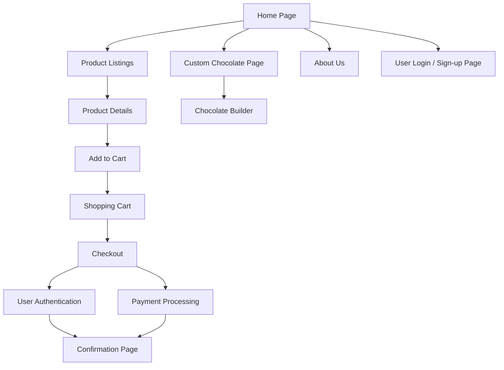

# ChocFactory Site Map

# Introduction to ChocFactory Site Map with AWS Integration

Our e-commerce platform, **ChocFactory**, is built on AWS to provide scalability, security, and reliability. Let's walk through the site map, explaining how the different features of the website are powered by AWS services.

## 1. Home Page
The **Home Page** is the entry point where users can access product listings, custom chocolate creation, or log in.

**AWS Services Used**:
- **Amazon S3**: Stores and delivers static content (images, CSS, HTML) for a fast and secure experience.
- **Amazon CloudFront**: Acts as a Content Delivery Network (CDN) to ensure global delivery of content with low latency.

## 2. Product Listings
Displays all available products. Each product links to a **Product Details** page. Users can add products to the cart, leading to the **Shopping Cart**.

**AWS Services Used**:
- **Amazon RDS**: Hosts the product database, ensuring fast and scalable access to product data.
- **Amazon EC2**: Powers the backend logic for handling user requests and dynamic content.

## 3. Shopping Cart & Checkout
The **Shopping Cart** allows users to view, manage, and edit their selected items.  
Checkout involves securing the user's authentication and payment processing.  
After a successful purchase, the **Confirmation Page** shows order details and delivery estimates.

**AWS Services Used**:
- **Amazon EC2**: Handles the backend for cart and checkout processes.
- **AWS IAM**: Manages permissions and security for the cart and payment processing.
- **Amazon Cognito**: Provides secure user authentication during checkout.
- **AWS Lambda**: Processes payments through third-party gateways (like Stripe or PayPal) for serverless transaction handling.

## 4. Custom Chocolate Page
This page offers an interactive **Chocolate Builder** tool, allowing users to personalize their chocolates.

**AWS Services Used**:
- **Amazon S3**: Stores and delivers product images, such as chocolate options, with low latency.
- **AWS Lambda**: Processes user input (e.g., customization choices), ensuring scalability.
- **Amazon API Gateway**: Connects frontend requests to backend logic for real-time customization.

## 5. About Us
Shares the story and vision of **ChocFactory**.

**AWS Services Used**:
- **Amazon S3** and **Amazon CloudFront**: Deliver this static content globally with speed and security.

## 6. User Login / Sign-up
Users can log in or sign up through this page to manage their accounts or track orders. This ensures secure access to the platform.

**AWS Services Used**:
- **Amazon Cognito**: Provides secure and scalable user authentication, supporting multi-factor authentication for added security.
- **AWS IAM**: Ensures that user permissions are properly managed.

## Conclusion with AWS
By integrating AWS services, **ChocFactory** delivers a secure, scalable, and responsive e-commerce experience. Each part of the platform—from product listings to payment processing—leverages AWS technologies to ensure reliability and high performance.  
AWS services like **Amazon EC2**, **RDS**, **S3**, **Cognito**, and **CloudFront** work together to handle the high demands of e-commerce while maintaining data security and performance.
